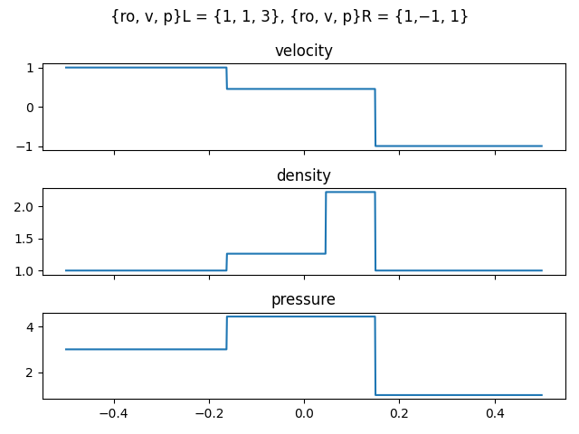
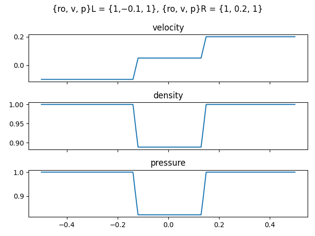

# Riemann problem solver

## Solver API

You create solver:

```c++
gas_discontinuity discontinuity {
  .left  = gas_state { .density = 1.0, .velocity = 0.0, .pressure = 3.0 },
  .right = gas_state { .density = 1.0, .velocity = 0.0, .pressure = 1.0 },
  .gamma = gamma
};

solver solver(discontinuity);
```

Then you can recive function, representing solution:

```c++
auto solution = solver.solve();

gas_state state = solution(t, x);

out << x << " " << state.density << " " << state.velocity << " " << state.pressure << std::endl;
```

## This project uses

* C++23
* Meson build system for C++
* Matplotlib for plotting results

## Solutions





